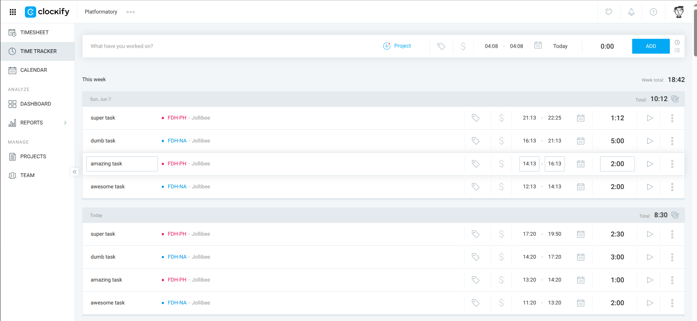
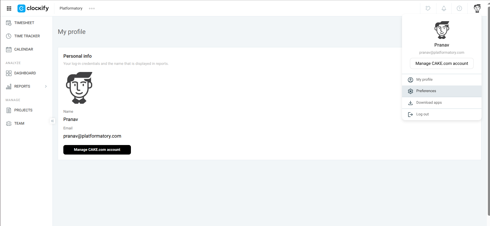
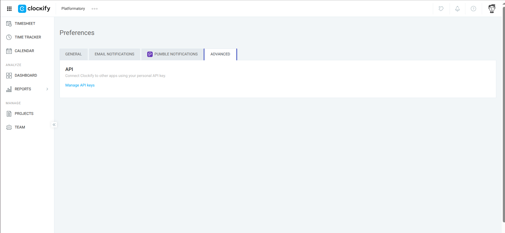
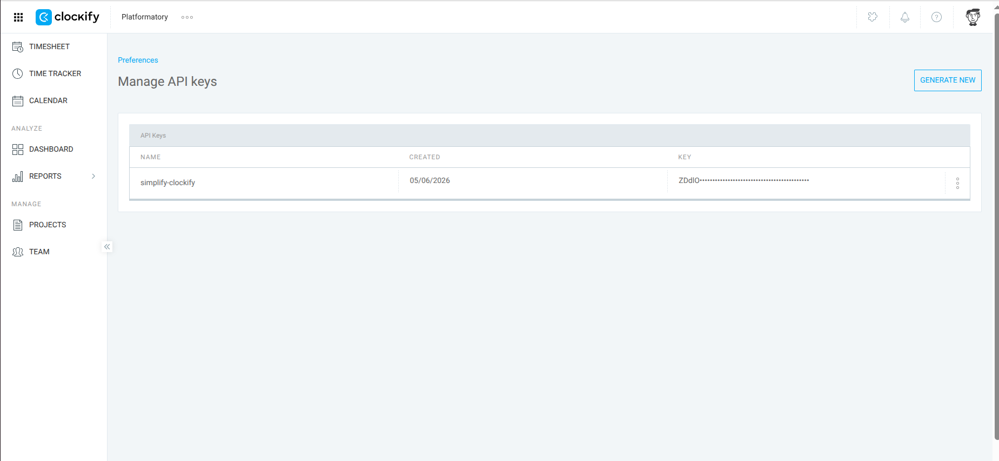

<h1>Simplify Clockify</h1>

> **Last updated**: 2026-06-06

---

**Contents**:

- [About](#about)
- [Usage](#usage)
- [Benefit](#benefit)
- [Potential Development Direction](#potential-development-direction)
- [Demo](#demo)
- [References](#references)
  - [Clockify REST API Documentation](#clockify-rest-api-documentation)
  - [API Integration with Python](#api-integration-with-python)
- [Notes](#notes)
  - [How to Create API Key for Auth](#how-to-create-api-key-for-auth)
  - [More About `simplify_clockify_utils`](#more-about-simplify_clockify_utils)

---

# About
The Clockify is a bit slow when you've got a lot of tasks to write about and not a lot of patience.

*The worst part of the entry has to be the time entries!*

This project aims to cut down the time taken to update Clockify entries :D

# Usage
In the current directory:

- Enter configs in [`configs.yaml`](./configs.yaml)
- Enter task details in [`entries.yaml`](./entries.yaml) <br> **Format details**: [`entries.yaml--format.md`](./entries.yaml--format.md)
- Run [`RUNME.py`](./RUNME.py) to add your tasks to Clockify

THAT'S IT!!!

But, of course, you have to fill [`entries.yaml`](./entries.yaml) as per your tasks.

# Benefit
- IMO, it's much faster to edit a YAML than muck about with the Clockify UI
- You don't need to fill timestamps; just enter... <br> - the time taken <br> - the start date and time <br> ... and the rest of the timestamps are auto-calculated <br> *With the UI, this was the most annoying part of Clockify entries for me!*

# Potential Development Direction
In the future, local backups and event logging can be implemented for:

- Traceability of task-logging activities
- Easy reference for oneself
- Easy transfer of task data for other documentatin purposes

I also want to implement ways to conveniently delete tasks (e.g. if you submitted some by mistake).

# Demo
- Date: 2026-06-06
- Time: 05:00 hours
- Entries: [`entries.yaml--demo--2026-06-06--0500.yaml`](./entries.yaml--demo--2026-06-06--0500.yaml)

Result on Clockify:



# References
## Clockify REST API Documentation
**General API reference**:

- Introduction: https://docs.clockify.me/#section/Introduction
- Authentication: https://docs.clockify.me/#section/Authentication
- Where to generate API key for your account: https://clockify.me/help/troubleshooting/general-api-troubleshooting/where-to-generate-api-key-for-account

**Specific references**:

- Get logged-in user's info: https://docs.clockify.me/#tag/User/operation/getLoggedUser
- Get all workspaces of the user: https://docs.clockify.me/#tag/Workspace/operation/getWorkspacesOfUser
- Get all projects in a workspace: https://docs.clockify.me/#tag/Project/operation/getProjects
- Create a time entry: https://docs.clockify.me/#tag/Time-entry/operation/createTimeEntry

## API Integration with Python
https://realpython.com/api-integration-in-python/

# Notes
## How to Create API Key for Auth
> **Reference**: Where to generate API key for your account: https://clockify.me/help/troubleshooting/general-api-troubleshooting/where-to-generate-api-key-for-account

---

| Step | Image Reference |
| --- | --- |
| 1 |  |
| 2 |  |
| 3 |  |

In the last step, click on `GENERATE NEW` to generate a new API key.

## More About `simplify_clockify_utils`
Contains:

- [`handler4configs.py`](./simplify_clockify_utils/handler4configs.py) <br> ... to handle loading of configs in runtime
- [`handler4requests.py`](./simplify_clockify_utils/handler4requests.py) <br> ... to provide a base wrapper for GET and POST operations (encapsulating auth)
- [`handler4getting_setup_info.py`](./simplify_clockify_utils/handler4getting_setup_info.py) <br> ... to handle getting and loading user, workspace and projects details in runtime
- [`handler4posting_time_entries.py`](./simplify_clockify_utils/handler4posting_time_entries.py) <br> ... to handle posting time entries using all the loaded configs and info in runtime

There is a simple class hierarchy:

```
Handler4Requests
      |
(inherited by)
      |
      v
Handler4GettingSetupInfo
      |
(inherited by)
      |
      v
Handler4PostingTimeEntries
```

`Handler4Configs` is separate from the above and is loaded as an attribute object within the above.